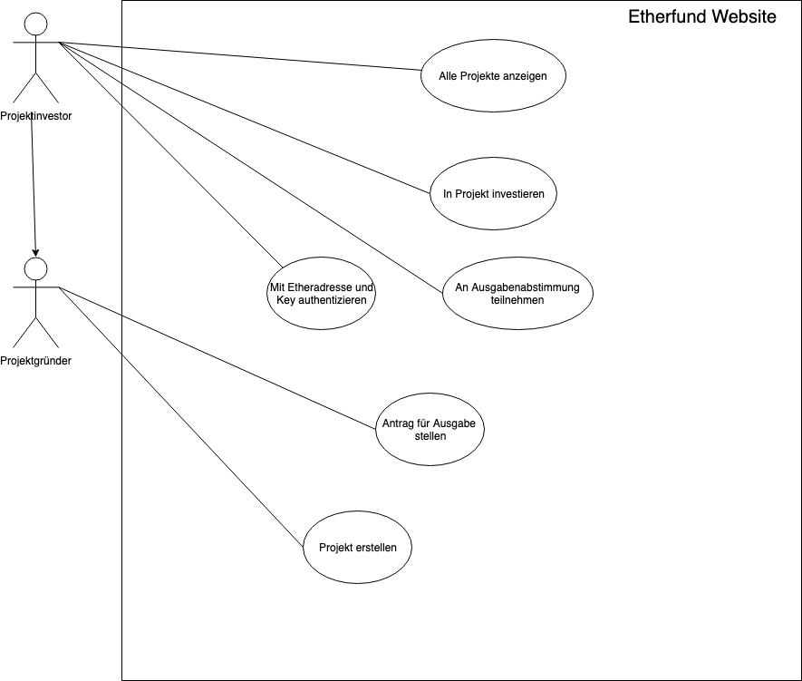
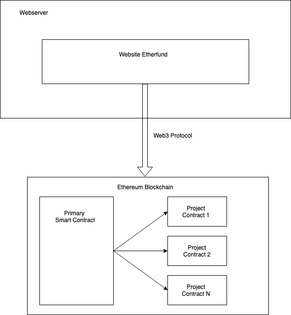

# Anforderungs- und Entwurfsspezifikation ("Pflichtenheft")

* Titel, Autoren, Inhaltsverzeichnis
* Link zum Source Code Repository
 

# 1 Einführung

## 1.1 Beschreibung
    
    Projektidee 1: Etherchain
    
    Etherchain ist eine Platform, auf der die gesammte oder teilweise Supply Chain eines Unternehmens 
    abgebildet werden kann. Die Idee ist, dass Unternehmen Angebote für beispielsweise 
    Transportaufträge, Materialaufträge oder Verarbeitungsaufträge als Smart-Contract auf der 
    Blockchain einstellen können. 
    Die Bezahlung wird im beim Anlegen des Contracts auf diesem hinterlegt. Ein anderes Unternehmen hat 
    dann die Möglichket, die Angebote auf der Blockchain zu durchsuchen und gegebenenfalls einen 
    geeigneten Auftrag anzunehmen. Bei Annahme muss das Unternehmen den Auftragswert als Sicherheit 
    hinterlegen. Wird der Auftrag erflgreich ausgeführt, erhält es die gestellte Sicherheitssumme zurück, 
    als auch die gestellte Bezahlung. Sind sich die Vertragspartner uneinig, so bleiben Bezahlung und 
    Sicherheit auf dem Contract, bis sich beide Parteie einigen. 

    Projektidee 2: Etherfunding

    Etherfunding ist eine Crowdfunding Plattform, bei der Mitglieder Projekte unterstützen können.
    Dabei können die Unterstüzer Geld an einen Smart Contract senden, und im Gegenzug ein Produkt
    erhalten, falls das unterstützte Projekt erfolgreich Umgesetzt wird. Eine Abgerenzung zu 
    anderen Crowdplatformen könnte sein, dass Unterstützer Kontrolle darüber bekommen, wofür
    das Geld im Smart Contract ausgegeben wird. Ein Exit Scam könnte auf diese Weise verhindert
    werden. Die Überlegung wäre hier, dass die Projektgründer Ausgaben begründen und im 
    Nachhinein Belege vorlgegen müssen, bevor die Projektunterztützer weiteres Geld aus dem 
    Vertrag freigeben. Dies würde das Projekt transparenter machen und Vertrauen würde von
    Projektgründen auf die Blockchain verlagert.

    Projektidee 3: CampusCoin
    
    Der CampusCoin ist eine Blockchain-Plattform, welche eine globale Leistungsakkreditierung für
    absolvierte Studiumsmodule bewerkstelligen soll. Mithilfe des CampusCoin ist es Lehrenden möglich 
    den Studenten, entsprechend der abgelegten Prüfung, eine gewisse Menge an Coins zu senden. Die Coins 
    spiegeln entsprechend die aktuell genutzten Credit Points wieder,  sind nur durch zertifizierte 
    Lehrende/Universitäten ausstellbar und können nicht unter Studierenden ausgetauscht werden. Durch 
    die Blockchain ist es anderen Entitäten möglich die Leistungen der Studierenden zu verifizieren 
    und ermöglicht somit den internationalen Transfer und Vergleich zwischen Universitäten.

    Projektidee 4: EtherRights
	
    EtherRights ist eine Plattform, auf der Lizenz- und Nutzungsrechte für diverse Medien erworben 
    werden können. Urheber können die Rechte an ihren Werken in Form eines SmartContracts zum 
    Verkauf anbieten. Beim Auslösen des SmartContracts erhält der Käufer einen Token, welcher 
    einmalig ist und sowohl dem Nutzer als auch dem Produkt zugeordnet werden kann. Möchte 
    ein Nutzer das erworbene Werk nun beispielsweise auf seiner Webseite nutzen, so kann er 
    seinen Token als Meta-Eigenschaft an das Bild/Video/etc. hängen, wodurch öffentlich 
    nachvollziehbar angezeigt werden kann, dass die Rechte für die Datei erworben wurden. 
    EtherRights könnte somit weiterhin eine Grundlage bieten, um für kommende Upload-Filter 
    eine Datenbank mit geschützten Inhalten und gleichzeitig eine „Lookup-Table“ mit erworbenen 
    Rechten bereitzustellen. 
    
    
## 1.2 Ziele

    Was ist Etherfundings Ziel?

    Das Ziel von Etherfundung soll eine Plattfrom sein, auf der Nutzer Projekte vorstellen können 
    und Geld in Form von Ether von anderen Nutzern der Platform einsammeln können. Dabei werden 
    diese "anderen" Nutzer der Platfrom zu Stakeholdern des Projektes. Da das Projket über einen
    Smart Contract auf der Blockchain abgebildet werden soll, soll allen Stakeholdern das 
    Recht eingeräumt werden, über die Ausgaben im Projekt mitzubestimmen. Der Projektgründer
    kann über eine Funktion im Smart Contract eine Anfrage an alle Stakeholder stellen, in welcher
    Aufgelistet ist wieivel Geld für einen bestimmten Meilenstein im Projekt benötigt wird und
    für welchen Zweck. Die Stakeholder können dann über eine andere Funktion im SC abstimmen, ob
    der Zweck diese Ausgabe rechtfertigt oder nicht. Es müssen mindesten 50% aller Stakeholder eine
    Ausgabe genemigen, bevor der Smart Contract diese Summe auszahlt. Da die Stakeholder selber
    Ether in das Projekt investiert haben, gibt es hier einen starken Insentive, für Ausgaben
    abzustimmen. Gleichzeitig wird das Risiko gesengt, dass der Projektgründe mit dem gesammten
    Ether verschwindet, da er in diesem Fall einen Antrag für das gesammte Ether auf dem Contract 
    stellen müsste, welchem die Stakeholder vermutlich nicht zustimmen würden.

    An wen richtet sich Etherfunding?

    Für das Etherfunding Projekt gibt es zwei unterschiedliche Parteien, wie in den Zielen bereits
    ersichtlich: Den Projekktgründer und die Projektstakeholder. Der Projektgründer ist eine
    Person, die breite Erfahrungen mit Blockchain-Technolgie gemacht hat und bereits weiß,
    was Crowdsourcing ist und welche Erfahrungen und Risiken diese Form der Investmentsuche
    birgt. Unter Umständen hat diese Person breits ein Projekt auf Kickstarter erfolgreich
    durchgeführt und sucht nun nach Wegen, die Stakeholder mehr in das Projekt einzubeziehen.

    Die Stakeholder sind ebenfalls Personen, welche bereits Erfahrung mit der 
    Blockchain-Technologie gemacht haben. Auch können es Personen sein, die sich in das Thema
    eingelesen haben und Etherfunding als parktischen Einstig in die Technologie sehen. 
    Stakeholder sind generll Personen, die ein überdurchschnittliches Technikverständnis haben,
    breits Crowdfunding Platformen wie Indigogo oder Kickstarter genutzt haben und sich eine
    bessere Kontrolle über das Projekt wünschen. Das traditionelle Modell von einmal
    Zahlen und hofffen das alles gut geht ist diesen Personen zu wenig.  

    Was ist Etherfunding nicht?

    Etherfunding kann nicht garantieren, dass die Versprechen des Projektes eingehalten werden.
    Am Ende des Projektes sollte ein Gut geschaffen werden, welche an die Investoren geliefert
    wird. Da am Ende des Projektes das Geld aus dem Contract ausgegeben ist, besitzt der Contract 
    keinen monitarische Bindung mehr, dass die Güter auch an die Stakeholder rausgehen. Der
    Contract kann lediglich sicherstellen, dass die Gelder für den richtigen Zweck ausgegeben werden.

# 2 Anforderungen

## 2.1 Stakeholder

| Funktion | Name | Kontakt | Verf¸gbarkeit | Wissen  | Interesse & Ziele  | Relevanz  |
|---|---|---|---|---|---|---|
| Projektgründer  |  Herr Bauer | Tel. 409000  | Von 9-19 Uhr telefonisch erreichbar, Mitarbeit zu 100% mˆglich, Berlin  | Hat schon Erfahrung mit Projektstarts bei Kickstarter und GoFundMe. Kennt alle Spezifikationen des anzubietenden Produkts   | Finanzierung der Produktion seines Projektes  | Projektleiter, Finanzieller und Fachlicher Entscheider  |
| Projektinvestor  | Herr Heiner  | Heiner@gmx.net  | Per E-Mail, sporadisch erreichbar, geringe Verfügbarkeit, Nürnberg  | Hat einmal ein Projekt bei Kickstart gebackt. Hat sich einige Projekte bei GoFundMe angeschaut|  Simpler Backingprozess, Sicherheit der verantwortungsbewussten Nutzung seines Investments | Investor und Kunde  |

## 2.2 Funktionale Anforderungen

    - Use-Case Diagramme
    - Strukturierung der Diagramme in funktionale Gruppen

## 2.3 Nicht-funktionale Anforderungen 

### 2.3.1 Rahmenbedingungen
	- Nutzt die Ethereum Blockchain
	- Entsprechend auch die Kryptowährung Ether, um Projekte zu backen

### 2.3.2 Betriebsbedingungen
	- Für Nutzer: 
		- Moderner Webbrowser (Chrome Version ab 67.0/Firefox ab 61.0)
	- Node-Betreiber(?)

### 2.3.3 Qualitätsmerkmale
Qualitätsmerkmal | sehr gut | gut | normal | nicht relevant
---|---|---|---|---
**Zuverlässigkeit** | | | | |
Fehlertoleranz |X|-|-|-|
Wiederherstellbarkeit |X|-|-|-|
Ordnungsmäßigkeit |X|-|-|-|
Richtigkeit |X|-|-|-|
Konformität |-|X|-|-|
**Benutzerfreundlichkeit** | | | | |
Installierbarkeit |-|X|-|-|
Verständlichkeit |-|X|-|-|
Erlernbarkeit |-|-|X|-|
Bedienbarkeit |-|X|-|-|
**Performance** | | | | |
Zeitverhalten |-|-|-|X|
Effizienz|-|-|-|X|
**Sicherheit** | | | | |
Analysierbarkeit |X|-|-|-|
Modifizierbarkeit |X|-|-|-|
Stabilität |-|-|X|-|
Prüfbarkeit |X|-|-|-|

## 2.4 Graphische Benutzerschnittstelle
    - GUI-Mockups passend zu User Stories
    - Screens mit ‹berschrift kennzeichnen, die im Inhaltsverzeichnis zu sehen ist
    - Unter den Screens darstellen (bzw. verlinken), welche User Stories mit dem Screen abgehandelt werden
    - Modellierung der Navigation zwischen den Screens der GUI-Mockups als Zustandsdiagramm

## 2.5 Anforderungen im Detail

| **Name** | **Als** | **möchte ich** | **so dass** | **Akzeptanz** | Priorität
| :------ | :------ | :----- | :------ | :-------- | :-------- |
| | Projektgründer | ein Projekt erstellen können | ich Unterstützung erhalten kann | Projekt ist erstellt und unterstützbar | Muss |
| | Projektgründer | ein Projektziel festlegen | der Pool bei Erfolg ausgegeben oder bei Misserfolg zurückgegeben wird | Projektziel ist einsehbar | Muss |
| | Projektgründer | Backing-Option anlegen können | Investoren sehen, was sie für ihr Geld erhalten | Backing-Optionen sind bei Backing auswählbar durch SC| Muss |
| | Projektgründer | einen Antrag für Ausgaben stellen können | Ether aus dem Pool erhalten kann | Antrag ist erstellt und muss von Backern akzeptiert oder abgelehnt werden | Soll |
| | Projektinvestor | eine Projektübersicht einsehen können | ich interessante Projekte entdecken kann | Projekte werden angezeigt | Muss |
| | Projektinvestor | eine Backing-Option wählen können | ich ein Projekt unterstützen kann | Ether in SC eingezahlt | Muss |
| | Projektinvestor | an Ausgabeabstimmungen teilnehmen können | Anträge abgelehnt oder angenommen werden | Stimme abgegeben | Soll |
| | Projektinvestor | mich über meine Etheradresse und meinen Key authentifizieren können | eingeloggt bin  | Authentifizierter Benutzer | Muss |

# 3 Technische Beschreibung

## 3.1 Systemübersicht

    Grobe Systemarchtitektur, prinzipell gibt es nur 2 Schichten, da die Blockchain im die Aufgabe des
    Backendserver und der Datenbank übernehmen kann. Daher gibt es im System nur ein Server, auf welchem
    das Frontend als Webseite läuft und ein Backend in Form der Ethereum Blockchain, welches innerhalb
    der Smart Contracts Daten verwaltet und Aufgaben des Backendservers übernimmt. Innerhalb der Blockchain
    wird es zwei Verträge geben. Der Primary SC hälte alle Projekt SC in einer Datenstruktur und kann dem
    Nutzer auskunft geben, welche Projekte grade aktive sind. Dieser Primary Contract ist eine Art Factory
    für Smart Contract, welche die Projekte der Projektgründer darstellen. Es gibt als immer mindestens eine
    Primary Contract und 0 bis N Project Contracts für die Projektgründer. 
    - Kommunikationsprotokolle, Datenformate

## 3.2 Softwarearchitektur
    - Darstellung von Softwarebausteinen (Module, Schichten, Komponenten)

## 3.3 Schnittstellen
    - Schnittstellenbeschreibung
    - Auflistung der nach auflen sichtbaren Schnittstelle der Softwarebausteine

## 3.4 Datenmodell 
    - Konzeptionelles Analyseklassendiagramm (logische Darstellung der Konzepte der Anwendungsdom‰ne)
    - Modellierung des physikalischen Datenmodells 
      - RDBMS: ER-Diagramm bzw. Dokumentenorientiert: JSON-Schema

## 3.5 Abl‰ufe
    - Aktivit‰tsdiagramme f¸r relevante Use Cases
    - Aktivit‰tsdiagramm f¸r den Ablauf s‰mtlicher Use Cases

## 3.6 Entwurf
    - Detaillierte UML-Diagramme f¸r relevante Softwarebausteine

# 4 Projektorganisation

## 4.1 Annahmen
    - Nicht durch den Kunden definierte spezifische Annahmen, Anforderungen und Abh‰ngigkeiten
    - Verwendete Technologien (Programmiersprache, Frameworks, etc.)
    - Aufteilung in Git-Repositories gem‰fl Software- und Systemarchitektur und Softwarebbausteinen 
    - Einschr‰nkungen, Betriebsbedingungen und Faktoren, die die Entwicklung beeinflussen (Betriebssysteme, Entwicklungsumgebung)
    - Interne Qualit‰tsanforderungen (z.B. Softwarequalit‰tsmerkmale wie z.B. Erweiterbarkeit)

## 4.2 Verantwortlichkeiten
    - Zuordnung von Personen zu Softwarebausteinen aus Kapitel 3.1 und 3.2
    - Rollendefinition und Zuordnung

| Softwarebaustein | Person(en) |
|----------|-----------|
| Komponente A | Thomas Mustermann |

### Rollen

#### Softwarearchitekt
Entwirft den Aufbau von Softwaresystemen und trifft Entscheidungen ¸ber das Zusammenspiel der Softwarebausteine.

#### Frontend-Entwickler
Entwickelt graphische oder andere Benutzerschnittstellen, insbesondere das Layout einer Anwendung.

#### Backend-Entwickler
Implementiert die funktionale Logik der Anwendung. Hierbei werden zudem diverse Datenquellen und externe Dienste integriert und f¸r die Anwendung bereitgestellt.

### Rollenzuordnung

| Name     | Rolle     |
|----------|-----------|
| Thomas Mustermann | Softwarearchitekt |

## 4.3 Grober Projektplan
    - Meilensteine

### Meilensteine
* KW 43 (21.10)
  * Abgabe Pflichtenheft
* KW 44 (28.10) / Projekt aufsetzen
  * Repository Struktur
* KW 45 (4.11) / Implementierung
  * Implementierung #3 (Final)
* KW 48 (18.12) / Abnahmetests
  * manuelle Abnahmetestss
  * Pr‰sentation / Software-Demo

# 5 Anh‰nge

## 5.1 Glossar 
    - Definitionen, Abk¸rzungen, Begriffe

## 5.2 Referenzen
    - Handb¸cher, Gesetze

## 5.3 Index

